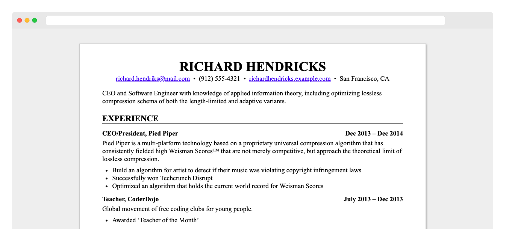

# resume.md

Write your resume in
[Markdown](https://raw.githubusercontent.com/mikepqr/resume.md/main/resume.md),
style it with [CSS](resume.css), output to [HTML](resume.html) and
[PDF](resume.pdf).

## Prerequisites

 - Python ≥ 3.6
 - [python-markdown](https://python-markdown.github.io/) (`pip install
   markdown`)
 - Optional, required for PDF output: Google Chrome or Chromium

## Usage

 1. Download [resume.py](resume.py), [resume.md](resume.md) and
    [resume.css](resume.css) (or make a copy of this repository by [using the
    template](https://github.com/mikepqr/resume.md/generate), forking, or
    cloning).

 2. Edit [resume.md](resume.md) (the placeholder text is taken with thanks from
    the [JSON Resume Project](https://jsonresume.org/themes/))

 3. Run `python3 resume.py` to build resume.html and resume.pdf.

     - Use `--no-html` or `--no-pdf` to disable HTML or PDF output.

     - Use `--chrome-path=/path/to/chrome` if resume.py cannot find your Chrome
       or Chromium executable.

## Customization

Edit [resume.css](resume.css) to change the appearance of your resume. The
default style is extremely generic, which is perhaps what you want in a resume,
but CSS gives you a lot of flexibility. See, e.g. [The Tech Resume
Inside-Out](https://www.thetechinterview.com/) for good advice about what a
resume should look like (and what it should say).

Change the appearance of the PDF version (without affecting the HTML version) by
adding rules under the `@media print` CSS selector.

Change the margins and paper size of the PDF version by editing the [`@page` CSS
rule](https://developer.mozilla.org/en-US/docs/Web/CSS/%40page/size).

[python-markdown](https://python-markdown.github.io/) is by default a very basic
markdown compiler, but it has a number of optional extensions that you may want
to enable (by adding to [the list of extensions
here](https://github.com/mikepqr/resume.md/blob/f1b0699a9b66833cb67bb59111f45a09ed3c0f7e/resume.py#L112)).
<code><a
href="https://python-markdown.github.io/extensions/attr_list/">attr_list</a></code>
in particular may by useful if you are editing the CSS.
